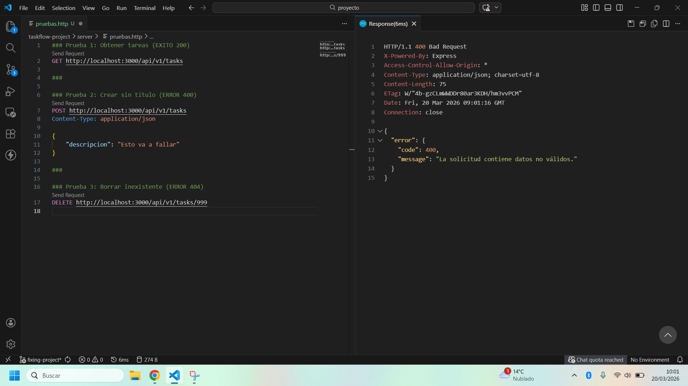
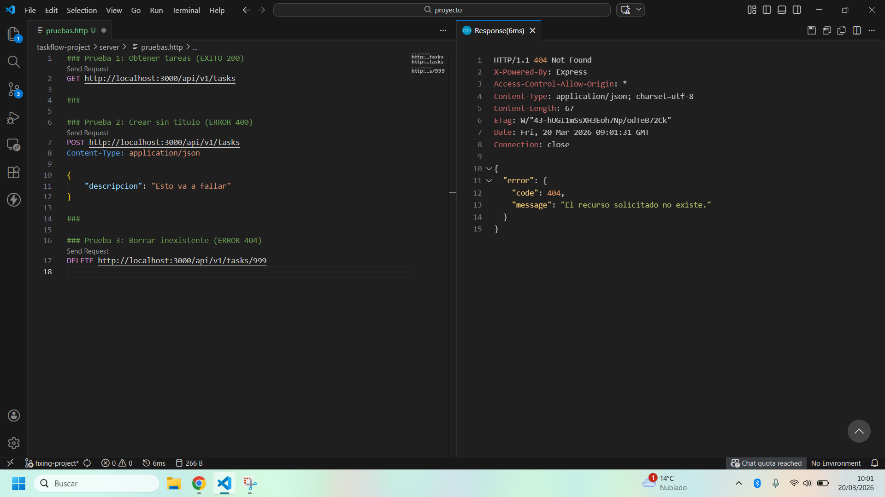
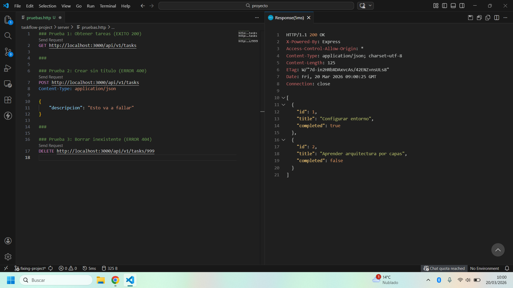

# 🚀 Fase C: Robustez, Manejo de Excepciones y Pruebas de Red

Este documento detalla la implementación de la capa de seguridad y estabilidad del servidor, garantizando que la API sea resistente a fallos y proporcione respuestas estandarizadas.

## 🛠️ 1. Manejo Global de Excepciones
Se ha implementado un **Middleware de Error** de 4 parámetros en `src/index.js`. Este componente actúa como un interceptor final que:
- Captura errores lanzados desde la capa de servicios (`NOT_FOUND`, `INVALID_DATA`).
- Evita que el proceso de Node.js se detenga ante fallos inesperados.
- Centraliza la respuesta al cliente, ocultando detalles técnicos sensibles (stack trace).

## 📊 2. Mapeo Semántico de Errores HTTP
La API traduce mensajes de error internos a códigos de estado estándar de la industria:

| Error Interno | Código HTTP | Significado |
| :--- | :--- | :--- |
| `INVALID_DATA` | **400** | La solicitud tiene un formato incorrecto o faltan campos. |
| `NOT_FOUND` | **404** | El recurso solicitado (ID) no existe en el sistema. |
| Otros fallos | **500** | Error interno del servidor no controlado. |

## 🧪 3. Colección de Pruebas de Integración
Para documentar y repetir las pruebas sin depender de herramientas de pago, se ha creado el archivo `pruebas.http` utilizando la extensión **REST Client**.

### A. Prueba de Validación: POST sin Título (Error 400)
Se intenta crear una tarea omitiendo el campo `title`. El controlador intercepta la falta de datos y el middleware responde con un 400.

> 

### B. Prueba de Existencia: DELETE ID Inexistente (Error 404)
Se intenta eliminar la tarea con ID `999`. El servicio lanza una excepción que el middleware traduce a un 404.

> 

### C. Prueba de Éxito: Listar Tareas (Status 200)
Se verifica que la ruta principal sigue funcionando correctamente tras implementar el manejo de errores.

> 

---
**Estado de la fase:** ✅ Completada y verificada.
